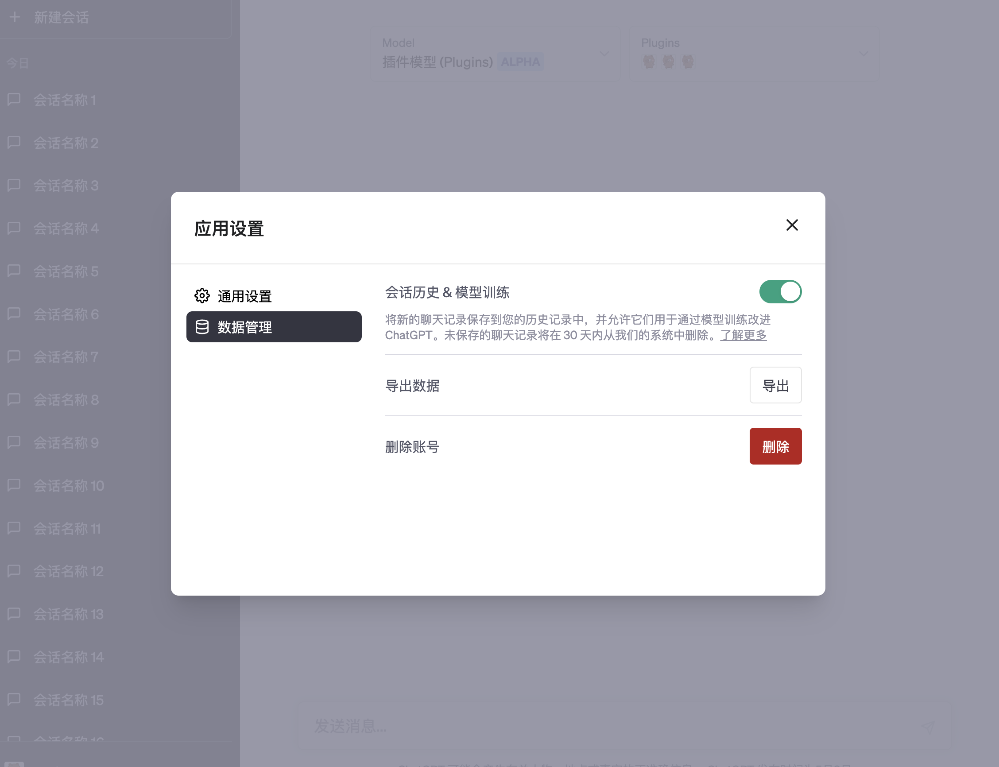

# Docker ChatGPT

One-click local version of ChatGPT, allowing access to various data sources and non-OpenAI models.

## Quick Overview

1. Download the project.

```bash
# download the latest version
git clone https://github.com/soulteary/docker-chatgpt.git
# or use zipball
wget https://github.com/soulteary/docker-chatgpt/archive/refs/heads/main.zip
```

2. Use docker to launch the project.

```bash
docker compose up
# or run in the daemon mode
docker compose up -d
```

Open your browser, visit `http://localhost:8090`, and enjoy.

## Customize

As an early version, you can directly use it to access the OpenAI API and get the same front-end experience as the official one.

In configuration file [docker-compose.yml](./docker-compose.yml), you can find configuration information suitable for you.


For more advanced usage, and previous practices, such as searching various vertical websites through it, using MidJoruney to draw pictures, you can refer to the video in the [sparrow project documentation](https://github.com/soulteary/sparrow).


## Screenshots


Conversation with the image.


Conversation with the plugin.


Customize the Model Switcher.


App Settings.



## Credits

- Backend: ChatGPT Style client-compatible Backend Server, open source implementation. [soulteary/sparrow](https://github.com/soulteary/sparrow)

## License

[WTFPL license](./LICENSE)
